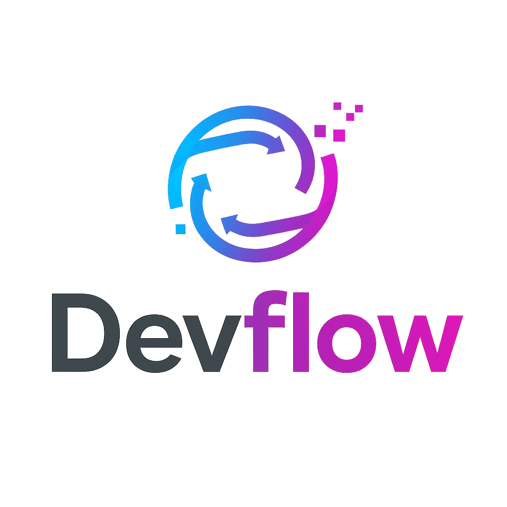

# DevFlow - Landing Page

 

Desenvolvido por: Humberto pimenta ferreira Filho

Uma landing page moderna e responsiva para o DevFlow, construída com React, Vite e Tailwind CSS. O objetivo é apresentar a ferramenta DevFlow, seus benefícios e planos.

**Link para o Deploy (GitHub Pages):** https://github.com/ferreiradev7/projeto-devflow-final

## ✨ Funcionalidades

* **Design Responsivo:** Adaptado para funcionar bem em desktops, tablets e dispositivos móveis.
* **Navegação Fixa (Sticky):** A barra de navegação permanece no topo durante a rolagem, com efeito de "vidro fosco" (`backdrop-blur`).
* **Rolagem Suave (Smooth Scroll):** Navegação suave entre as seções ao clicar nos links do menu.
* **Fundo Animado:** Gradiente sutil com cores fluidas que se movem lentamente.
* **Menu Mobile:** Menu "hambúrguer" funcional para telas menores, com ícones `react-icons`.
* **Seções:**
    * Header 
    * Sobre 
    * Planos 
    * Feedbacks 
    * Contato 
* **Estilização Moderna:** Utiliza Tailwind CSS para um design rápido e consistente.

## 🚀 Tecnologias Utilizadas

* **[React](https://reactjs.org/):** Biblioteca JavaScript para construção de interfaces de usuário.
* **[Vite](https://vitejs.dev/):** Ferramenta de build rápida para desenvolvimento frontend moderno.
* **[Tailwind CSS](https://tailwindcss.com/):** Framework CSS utility-first para estilização rápida.
* **[React Icons](https://react-icons.github.io/react-icons/):** Biblioteca para incluir ícones populares (como os do menu mobile).

## 🔧 Como Executar Localmente

Siga estas instruções para configurar e rodar o projeto na sua máquina local:

1.  **Clone o repositório:**
    ```bash
    git clone https://github.com/ferreiradev7/projeto-devflow-final 
    cd SEU-REPOSITORIO
    ```
    

2.  **Instale as dependências:**
    ```bash
    npm install
    ```

3.  **Inicie o servidor de desenvolvimento:**
    ```bash
    npm run dev
    ```
    O site estará disponível em `http://localhost:5173` (ou outra porta indicada no terminal).

## 📦 Build para Produção

Para criar a versão otimizada do site (a pasta `dist`):

```bash
npm run build